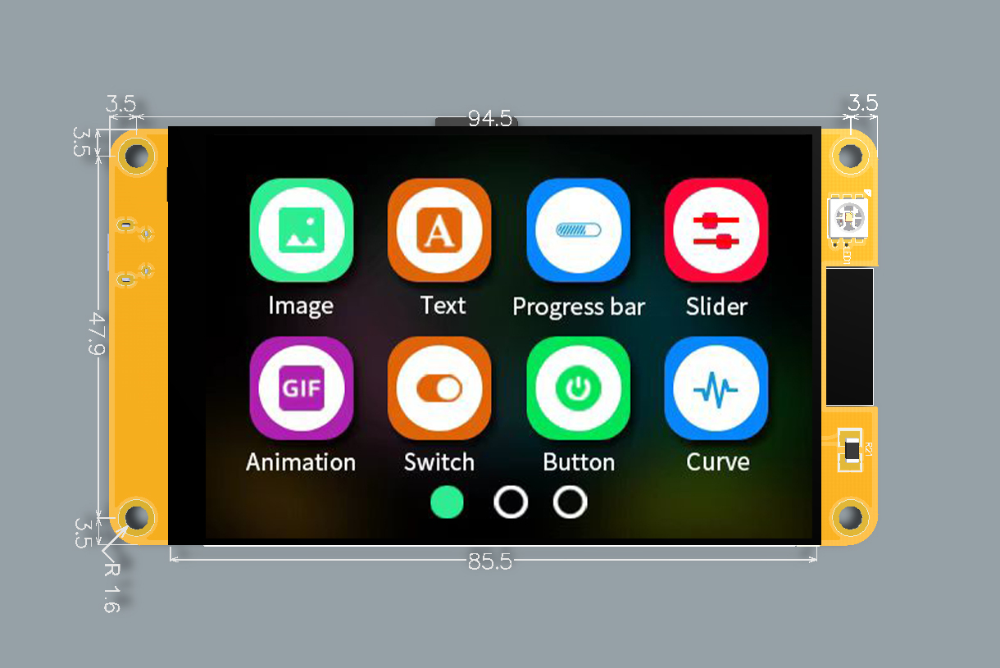
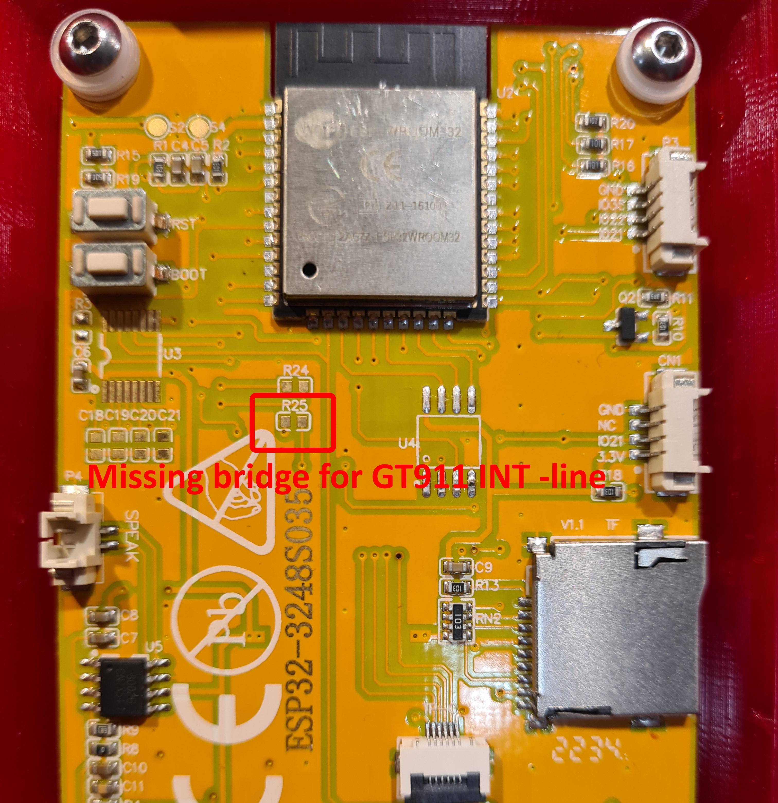
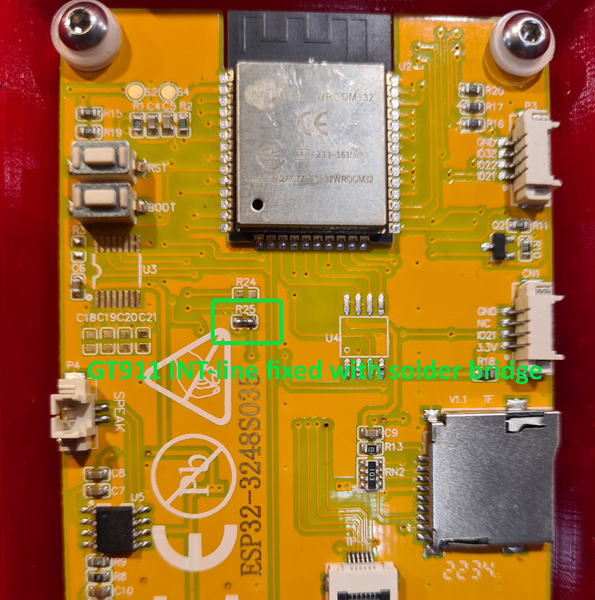

# CYD-Klipper
An implementation of a wireless Klipper status display on an ESP32 + 3.5" screen. Uses Moonraker to fetch data.

A simple and cheap solution to use a dedicated screen with Klipper, a 3d printing Firmware.

***Note - this display might have a missing resistor R25 whose solder pads needs to be bridged with soldering! Check below for more details.***

ESP32-3248S035C            |  3.5" display
:-------------------------:|:-------------------------:
|

### Required hardware

A ESP32-3248S035C is required to run this project. You can find out where to buy these on the ["ESP32 Cheap Yellow Display 3.5""](https://s.click.aliexpress.com/e/_DFOFokz) repository.

### Features
- View printer status
- View print progress
- Start a print
- Move the printer
- Manage temperature
- Extrude/Retract filament
- Execute predefined gcode macros

### Install

[There is a web-based installer available. This is only supported on Chrome, Edge or Opera, and only on Desktop.](https://OperatorB.github.io/CYD-Klipper/)

On initial install, all data should be wiped. On updates, data should be able to be kept without issues.

There are no 'over the air' updates. Each update has to be applied manually.

### Images
3.5" display               |  Capacitive
:-------------------------:|:-------------------------:
|
|
|
|

### GT911 issue and fix
~~Touch driver [GT911 uses an INT](https://github.com/TAMCTec/gt911-arduino/issues/7) line for selecting I2C address during bus initialization. Unfortunately,
you might find a missing resistor (R25) onboard which breaks this line between GPIO25 and GT911 INT.
To fix the derived issues the easiest way is to bridge the pads of R25 with soldering. See below.~~

3.5" display               |  GT911
:-------------------------:|:-------------------------:
|

### Enclosure

[Display Enclosure ESP32-3248S035](https://cults3d.com/:1482031)

### Credits
- [CYD-Klipper](https://github.com/suchmememanyskill/CYD-Klipper)
- [GT911 driver](https://github.com/TAMCTec/gt911-arduino)
- [xtouch](https://github.com/xperiments-in/xtouch)
- [ESP32-Cheap-Yellow-Display](https://github.com/witnessmenow/ESP32-Cheap-Yellow-Display)
